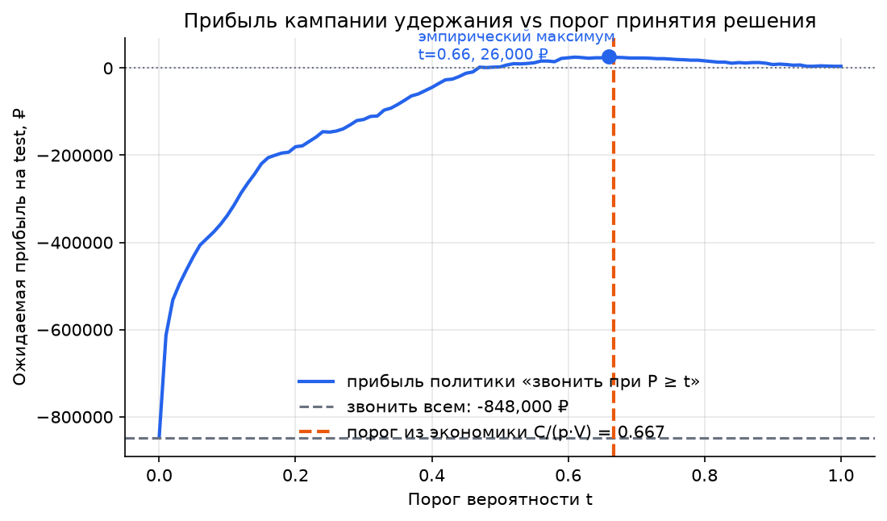
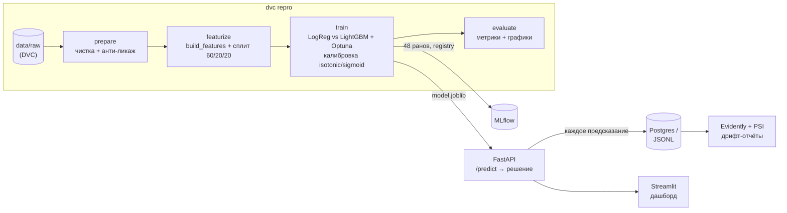

# Churn Scoring Platform

> Сервис скоринга оттока, который решает не «кто уйдёт», а **«кому звонить, чтобы заработать»**: откалиброванные вероятности + порог решения, выведенный из unit-экономики, в полном производственном контуре (DVC → MLflow → FastAPI → Docker → мониторинг дрифта).

[](https://github.com/Lake3L/ChurnCust/actions/workflows/ci.yml)


## Проблема

Телеком-оператор теряет клиентов: в датасете IBM Telco 26.5% абонентов расторгают контракт. Удержание дешевле привлечения, но кампания удержания не бесплатна: звонок с предложением скидки стоит денег и тратится на **каждого**, кому позвонили, а конверсия удержания далека от 100%.

Наивные политики проигрывают в обе стороны. «Звонить всем» — это −848 000 ₽ на тестовой когорте из 1409 клиентов: большинство и так не собирались уходить, а бюджет кампании сгорает. «Не звонить никому» — ноль затрат и молчаливая потеря маржи с каждым ушедшим. Даже разумное на слух бизнес-правило «звонить новичкам на месячном контракте» уходит в минус (−26 500 ₽).

Классическая ML-постановка «предскажи отток и отсеки по 0.5» тоже не решает задачу: порог 0.5 никак не связан с экономикой. Этот проект строит контур, в котором порог **выводится из экономики кампании**, вероятности **калибруются** (без этого экономический порог бессмыслен), сервис возвращает готовое бизнес-решение, а мониторинг замечает, когда данные «поехали».

## Результат

Финальные метрики на **отложенном test set** (1409 клиентов, распечатан один раз в самом конце):

| Политика | PR-AUC | ROC-AUC | Brier | Звонков | Ожидаемая прибыль |
|---|---|---|---|---|---|
| Не звонить никому | — | — | — | 0 | 0 ₽ |
| Звонить всем | — | — | — | 1409 | **−848 000 ₽** |
| Правило: month-to-month & tenure < 6 | — | — | — | 271 | −26 500 ₽ |
| LogReg на 5 фичах @ 0.667 | 0.640 | 0.835 | — | 111 | +19 500 ₽ |
| **LightGBM + isotonic @ 0.667** | **0.671** | **0.856** | **0.132** | 115 | **+24 500 ₽** |



**Главный вывод: эмпирический максимум прибыли на тесте достигается при пороге 0.66 — теоретический порог из экономики 0.667 попал в него почти точно. Это работает только потому, что вероятности откалиброваны.** Тот же классификатор с «наивным» порогом 0.5 заработал бы всего +2 500 ₽ — в 10 раз меньше.

## Экономика решения (откуда порог 0.667)

Числа кампании зафиксированы в [config/economics.yaml](config/economics.yaml): маржа с удержанного клиента за 12 мес `V = 5000 ₽`, стоимость контакта со скидкой `C = 1000 ₽` (тратится на каждого, кому позвонили), конверсия удержания среди реально уходящих `p = 0.3`.

Ожидаемая ценность звонка клиенту с вероятностью оттока `P`:

```
EV(звонок) = P·(p·V − C) + (1 − P)·(−C) = P·p·V − C
```

Звонить выгодно при `EV > 0`, то есть при `P > C / (p·V) = 1000 / 1500 = 0.667`. Порог — не гиперпараметр и не точка на ROC-кривой, а следствие экономики. Но формула честна только если `P` — реальная частота, поэтому калибровка вероятностей здесь обязательный шаг, а не украшение.

## Архитектура



- Одна функция `build_features()` используется и в обучении, и в API — защита от train/serve skew.
- Test set (20%) отложен на первом шаге и распечатан один раз — для финальной таблицы выше.
- Сервис отдаёт не «скор», а решение: `probability`, `decision`, `threshold`, `expected_value_of_call`, `model_version`.
- Каждое предсказание пишется в Postgres (или JSONL без БД) — это сырьё для мониторинга дрифта.
- Docker-образ API не содержит модель: артефакт монтируется томом, образ не привязан к версии модели.

## Данные и проверка утечек

**Источник:** [IBM Telco Customer Churn](https://www.kaggle.com/datasets/blastchar/telco-customer-churn) (sample dataset IBM, публичный) — 7043 клиента, полная версия с 33 колонками. «Уходящий клиент» = расторгнувший контракт в отчётном квартале (`Churn Value`). Файл фиксируется DVC (md5 в [data/raw/Telco_customer_churn.xlsx.dvc](data/raw/Telco_customer_churn.xlsx.dvc)), в git не попадает.

Полная IBM-версия датасета — отличный полигон для поиска ликажа, и он тут есть ([notebooks/01_eda.ipynb](notebooks/01_eda.ipynb)):

| Колонка | Признак утечки | Решение |
|---|---|---|
| `Churn Reason` | пропусков ровно 5174 — столько же, сколько неушедших: поле заполняется только при уходе | выброшена |
| `Churn Score` | ROC-AUC **0.942** против таргета — это выход чужой модели, знающей ответ | выброшена |
| `CLTV` | расчётная ценность клиента непрозрачного происхождения | выброшена консервативно |
| `CustomerID`, `Count/Country/State`, гео | ID, константы, гео-шум одного штата | выброшены |

Контрольный ритуал после обучения: топ важностей LightGBM — `contract` 21.7%, `charge_diff` 10.4%, `total_charges` 9.6%, `tenure_months` 9.4%, `avg_service_cost` 8.7%. Ни одна фича не доминирует подозрительно, в топе — интерпретируемые бизнес-драйверы. Вердикт: утечки нет.

Что показал EDA (полные графики в ноутбуке):

- Тип контракта — драйвер №1: month-to-month уходят в **~15 раз чаще** two-year (42.7% vs 2.8%).
- Первые месяцы решают: когорта 0–6 мес уходит на 54.3%, 48+ мес — на 9.6%.
- Оплата electronic check — 45.3% оттока против 15.2% у автосписания с карты.
- Fiber optic — 41.9% против 19.0% у DSL: дорогой продукт с завышенными ожиданиями.
- Ушедшие платят больше: медиана $79.6/мес против $64.4 у оставшихся.

## Как запустить

Нужны: [uv](https://docs.astral.sh/uv/), Docker (опционально — для полного стека). Датасет: скачать xlsx по ссылке выше в `data/raw/Telco_customer_churn.xlsx` (DVC сверит хеш).

```bash
git clone https://github.com/Lake3L/ChurnCust.git
cd ChurnCust
make install        # uv sync + pre-commit хуки
make repro          # dvc repro: данные -> модель -> отчёты (~2 мин)
make test           # 28 тестов, coverage ~74%
```

Полный стек (API + MLflow UI + Postgres + дашборд):

```bash
make up             # docker compose up --build -d
curl -X POST http://localhost:8000/predict -H "Content-Type: application/json" -d '{
  "gender": "Female", "senior_citizen": "No", "partner": "Yes", "dependents": "No",
  "tenure_months": 2, "phone_service": "Yes", "multiple_lines": "No",
  "internet_service": "Fiber optic", "online_security": "No", "online_backup": "No",
  "device_protection": "No", "tech_support": "No", "streaming_tv": "Yes",
  "streaming_movies": "Yes", "contract": "Month-to-month", "paperless_billing": "Yes",
  "payment_method": "Electronic check", "monthly_charges": 95.7, "total_charges": 191.4
}'
```

Ответ — бизнес-решение, а не сырое число (реальный ответ сервиса в контейнере):

```json
{
  "probability": 0.9187,
  "decision": "call",
  "threshold": 0.6667,
  "expected_value_of_call": 377.99,
  "model_version": "lightgbm-v1"
}
```

| Сервис | URL |
|---|---|
| API (Swagger) | http://localhost:8000/docs |
| Streamlit-дашборд | http://localhost:8501 |
| MLflow UI | http://localhost:5000 |

Без Docker: `uv run uvicorn app.main:app --port 8000` и `make dashboard`. Образ API — 806 МБ, multi-stage, non-root, с healthcheck; модель в него не запекается, а монтируется томом.

## Мониторинг дрифта

`make drift` симулирует три канонических сценария поверх тестовых данных (reference = valid) и прогоняет их через Evidently + собственный PSI-алертинг (порог 0.2):

| Сценарий | Evidently: drift | PSI-алерты по фичам | PSI(proba) | PR-AUC | Прибыль |
|---|---|---|---|---|---|
| контроль (без искажений) | нет (0/27) | 0 | 0.001 | 0.671 | +24 500 ₽ |
| **Covariate** (+30% к платежу) | 3/27 колонок | **3** (max 9.31) | 0.018 | 0.664 | +25 500 ₽ |
| **Prior** (доля оттока ×2) | 4/27 колонок | 0 | 0.047 | 0.804 | +75 500 ₽ |
| **Concept** (инверсия связи на 30%) | **нет (0/27)** | **0** | 0.001 | **0.498** | **−8 500 ₽** |

Вывод, ради которого всё затевалось: **covariate shift детектируется без разметки, prior shift виден слабо, а concept drift не виден вообще** — входы не изменились, изменилась связь `P(y|x)`. Единственная защита от concept drift — мониторинг качества на подъезжающей разметке (отложенные метки) — записана в [BACKLOG.md](BACKLOG.md).

## Ключевые инженерные решения (почему, а не что)

1. **Порог из экономики, а не из ROC.** `optimal_threshold()` — чистая функция от конфига экономики; поменялась стоимость контакта — порог пересчитался, модель не переобучается.
2. **Калибровка как условие применимости порога.** Сравнивались isotonic и sigmoid (5-fold на train, выбор по Brier на valid). Честная деталь: LightGBM после тюнинга оказался почти откалиброван из коробки (Brier 0.1318 до / 0.1324 после) — но именно проверка калибровки делает порог 0.667 обоснованным, и на тесте эмпирический оптимум (0.66) это подтвердил.
3. **Одна `build_features()` на train и serve.** Никакой дублированной логики фичей в API: тот самый train/serve skew закрыт архитектурно, а не код-ревью.
4. **Только детерминированные фичи вне пайплайна.** Всё, что требует fit (OHE, скейлинг), живёт в sklearn Pipeline и обучается только на train — утечка сплитов исключена конструктивно.
5. **Тесты экономики на синтетике с закрытыми формами.** `expected_profit` для «звонить всем» сверяется с формулой `N·(base_rate·p·V − C)`: если формула прибыли врёт, врут все числа проекта.
6. **CI без данных.** Тесты API работают на фикстурной модели, обученной на синтетических клиентах с теми же контрактами схемы; тесты реальных данных помечены skipif. CI зелёный на чистом клоне без DVC-remote.
7. **Metamorphic-тест с честной формулировкой.** Для GBDT поточечная монотонность по цене не гарантирована, поэтому тест проверяет популяционный сдвиг (+25% к платежу ⇒ средняя вероятность растёт) и ограничивает долю поточечных нарушений.

## Латентность

Замер: `make latency` (300 одиночных запросов + 50 батчей по 32), локальная машина, Windows 11, uvicorn 1 воркер, включая логирование предсказания в БД.

| Эндпоинт | p50 | p95 | p99 |
|---|---|---|---|
| `POST /predict` (1 клиент) | 65.4 мс | **73.8 мс** | 77.4 мс |
| `POST /predict/batch` (32 клиента) | 86.5 мс | 91.9 мс | 98.4 мс |

Целевой SLA (p95 < 100 мс на одиночный запрос) выполнен. Батч из 32 клиентов стоит всего +21 мс к p95 — время уходит не на инференс, а на постоянные накладные расходы (валидация Pydantic, `build_features`, round-trip в Postgres). Отсюда прямой ответ на вопрос «что сломается первым при 1000 RPS»: синхронная запись предсказания в БД на каждый запрос — её надо буферизовать/выносить в очередь; сам скоринг батчуется почти бесплатно.

## Тесты и CI

28 тестов (`make test`): экономика на синтетике, фичи (форма/значения/детерминированность/мутации), контракт данных (чистка ликажа, стратификация сплитов, диапазоны реальных данных), API (коды, схема, валидация, логирование предсказаний, 503 без модели), metamorphic, хелперы обучения и отчётов. Покрытие ~74% (порог осмысленности — 60%).

CI (GitHub Actions): ruff format + lint → pytest с coverage → сборка Docker-образа. Pre-commit: ruff, nbstripout (ноутбуки в git без выводов), trailing whitespace, large files.

## Ограничения и что бы я сделал иначе

- **Метка оттока ретроспективна:** модель учится на «кто уже ушёл», а бизнес-вопрос — «кто уйдёт». В проде нужна временная валидация (train на кварталах t, тест на t+1), здесь датасет одномоментный — это главное упрощение проекта.
- **Экономика кампании упрощена:** V, C, p одинаковы для всех клиентов. Реально V зависит от клиента (ARPU уже в данных) — персональный порог лежит в бэклоге и требует одной строчки математики, но честного А/В для проверки.
- **Prior shift почти не детектится текущими порогами** (PSI(proba) 0.047 при удвоении оттока): порог алерта на распределение скоров надо калибровать по историческим окнам, а не брать эвристику 0.2.
- **Постгрес-лог не является фича-стором:** для батч-переобучения по логам понадобится дедупликация и версия схемы фичей в каждой записи.
- **Optuna оптимизирует PR-AUC, а не прибыль.** Прямая оптимизация ожидаемой прибыли на valid — интересный эксперимент (в бэклоге); PR-AUC выбран как более стабильная прокси при 1409 объектах в valid.

## Чему я научился на этом проекте

1. **Калибровка — не всегда «до/после» с красивой картинкой.** Я ожидал, что LightGBM будет переуверен и калибровка резко улучшит Brier. На деле после тюнинга он оказался почти откалиброван (0.1318 → 0.1324, изотоника чуть проиграла в Brier, но выиграла в согласии эмпирического и теоретического порога). Полезный урок: проверка калибровки — обязательный шаг, но её результат не обязан быть эффектным, и подгонять его нельзя.
2. **Бизнес-метрика жёстче ML-метрики.** ROC-AUC 0.856 звучит солидно, а прибыль при пороге 0.5 — всего +2 500 ₽ против +24 500 ₽ при экономическом пороге. Одна и та же модель, разница в 10 раз — целиком в порогах.
3. **Concept drift невидим, и это надо честно писать.** Симуляция показала: PR-AUC падает 0.671 → 0.498, прибыль уходит в минус, а все безразметочные детекторы молчат (PSI 0.001, Evidently — 0/27 колонок). Раньше я бы поставил Evidently и считал мониторинг закрытым.
4. **Полный IBM-датасет — ловушка с ликажем.** `Churn Score` даёт ROC-AUC 0.942 сам по себе: возьми я «все числовые колонки», получил бы отличную метрику и бесполезную модель.
5. **Что бы сделал иначе:** начал бы с временной валидации, а не со случайного сплита — она ближе к реальной постановке, и её отсутствие пришлось честно записать в ограничения.

## Вопросы, которые проект закрывает (для собеседования)

Почему порог 0.667, а не 0.5 · что произойдёт с порогом при плохой калибровке · как закрыт train/serve skew · почему PR-AUC, а не accuracy · как проверялась утечка · какой дрифт детектируется без разметки, а какой нет · что сломается первым при 1000 RPS · на сколько рублей модель лучше «звонить всем» (ответ: на 872 500 ₽ на когорте из 1409 клиентов).

## Стек

Python 3.11 · uv · pandas · scikit-learn · LightGBM · Optuna · MLflow · DVC · FastAPI · Pydantic v2 · SQLAlchemy · PostgreSQL · Evidently · Streamlit · Docker Compose · pytest · ruff · pre-commit · GitHub Actions
